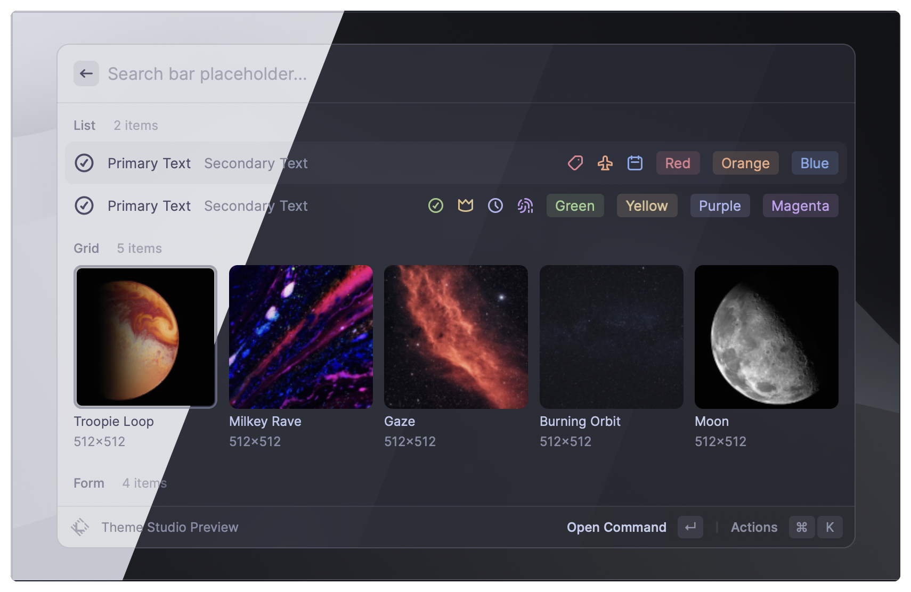
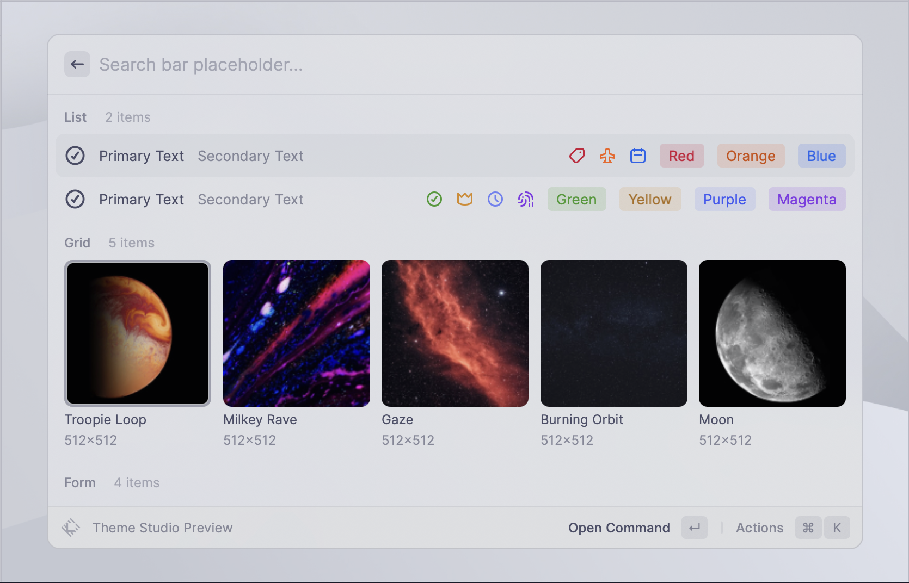
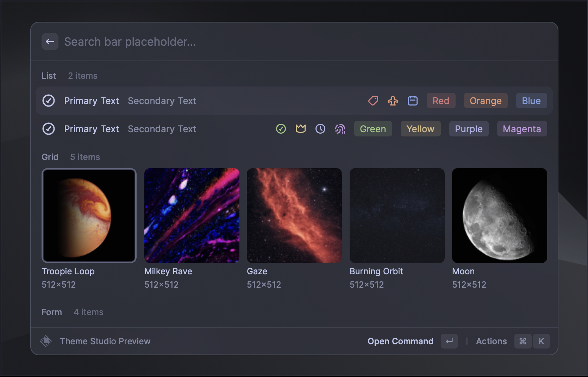
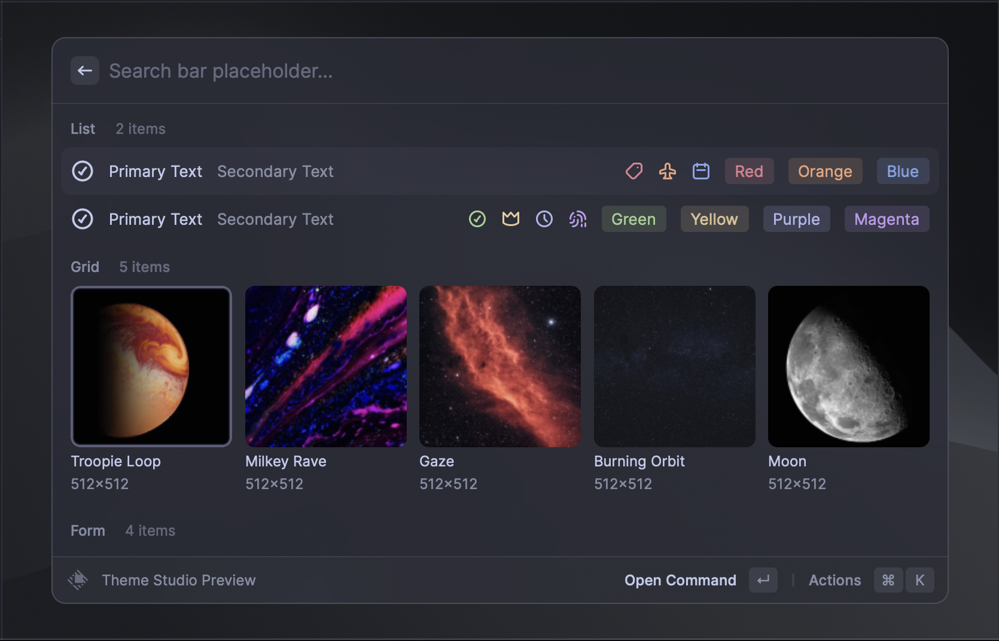

<h3 align="center">
   
  
  Catppuccin for <a href="https://www.raycast.com/">Raycast</a>
  
</h3>

  
  
  

  

## Previews

🌻 Latte

🪴 Frappé

🌺 Macchiato

🌿 Mocha

## Usage

Click one of the following links to install the theme to your profile:
- [🌻 Latte](https://themes.ray.so?version=1&name=Catppuccin%20Latte&colors=%23eff1f5,%23eff1f5,%234c4f69,%239ca0b0,%238c8fa1,%23d20f39,%23fe640b,%23df8e1d,%2340a02b,%231e66f5,%237287fd,%238839ef&appearance=light)
- [🪴 Frappé](https://themes.ray.so?version=1&name=Catppuccin%20Frappé&colors=%23303446,%23303446,%23c6d0f5,%23737994,%23838ba7,%23e78284,%23ef9f76,%23e5c890,%23a6d189,%238caaee,%23babbf1,%23ca9ee6&appearance=dark)
- [🌺 Macchiato](https://themes.ray.so?version=1&name=Catppuccin%20Macchiato&colors=%2324273a,%2324273a,%23cad3f5,%236e738d,%238087a2,%23ed8796,%23f5a97f,%23eed49f,%23a6da95,%238aadf4,%23b7bdf8,%23c6a0f6&appearance=dark)
- [🌿 Mocha](https://themes.ray.so?version=1&name=Catppuccin%20Mocha&colors=%231e1e2e,%231e1e2e,%23cdd6f4,%236c7086,%237f849c,%23f38ba8,%23fab387,%23f9e2af,%23a6e3a1,%2389b4fa,%23b4befe,%23cba6f7&appearance=dark)

## 🙋 FAQ

- Q: **_"Why do I need Pro to install this theme?"_**\
  A: Sadly themes need a subscription to Raycast Pro to be enabled.
  It's not ideal, but if you happen to have Raycast Pro these are designed for
  you.

## 💝 Thanks to

- [RayhanADev](https://github.com/rayhanadev)

&nbsp;

	

	Copyright &copy; 2021-present <a href="https://github.com/catppuccin" target="_blank">Catppuccin Org</a>

	

